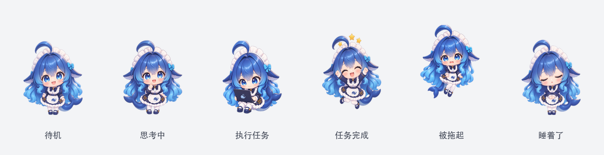
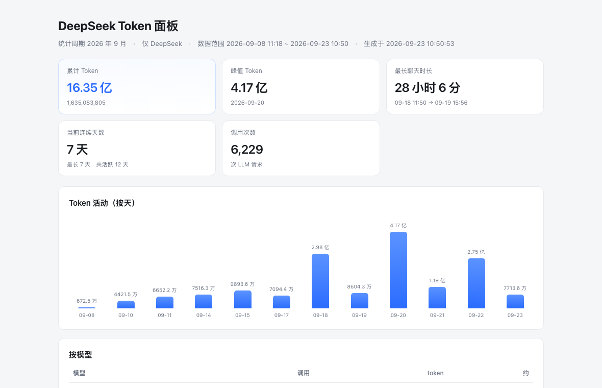

# WorkBuddy Token 用量面板 + 桌面宠物

两个本地小工具，都从一个数据源出发：**WorkBuddy 的本地会话记录**。

1. **用量面板** —— 把 WorkBuddy 里消耗的 token 统计出来，生成一个网页报告
2. **桌面宠物** —— 一只用透明窗口浮在桌面上的小鲸鱼娘，会**看着你干活**：
   你让她工作时她坐着敲电脑、思考时歪头、任务完成时跳起来、没动静了会睡着



> 顺带说明：**这不是 WorkBuddy 官方功能**，是一个独立的本地小工具，
> 只读 WorkBuddy 写在磁盘上的记录文件，不改它、也不联网。

---

## 30 秒上手

| 想干什么 | 怎么做 |
|---|---|
| 看这个月用了多少 token | 双击 **`查看用量.command`**（或 `python3 usage_stats.py --open`） |
| 让鲸鱼娘浮在桌面上 | 双击 **`启动桌面宠物.command`** —— 首次会自动编译窗口，约 10 秒 |
| 只想看看她的动画 | 双击 **`pet.html`** —— 不用装任何东西，也不需要 WorkBuddy |

环境要求：**macOS + Python 3**（统计与状态服务只用标准库）。
只有编译桌面窗口那一步才需要 Swift 命令行工具：`xcode-select --install`。

---

## 它解决什么问题

WorkBuddy 客户端**只显示积分（credits），不显示 token 数**。
但你想知道"这个月到底用了多少 token"的时候，客户端答不了。

好在这件事的原始数据一直在本地：每次 LLM 调用的 token 明细，
都写在 `~/.workbuddy/projects/<项目>/<会话>.jsonl` 里。
所以完全可以自己算出来 —— 这个项目就是把这件事做成能看的东西。

---

## 用量面板



```bash
python3 usage_stats.py              # 本月（默认只统计 DeepSeek）
python3 usage_stats.py --all        # 全部历史
python3 usage_stats.py --days 7     # 最近 7 天
python3 usage_stats.py --all-models # 不过滤模型
python3 usage_stats.py --open       # 生成后自动打开
```

macOS 上也可以**双击 `查看用量.command`**。

### 口径

`累计 Token = sum(total_tokens) = 输入 + 输出`，和 OpenAI / Codex 一致。

这个口径是**对照 Codex 本地记录验证过**的：

```json
// ~/.codex/sessions/**/rollout-*.jsonl 里的 token_usage_record
{"input_tokens": 26960, "cached_input_tokens": 16128, "output_tokens": 370,
 "total_tokens": 27330}          // 26960 + 370 = 27330 —— 缓存部分不额外剔除
```

所以两边算出来的数字**可以直接横向比**。

---

## 桌面宠物

```bash
双击 启动桌面宠物.command
```

- 透明、无边框、置顶的小窗口，**角色以外的区域会穿透鼠标** —— 不挡你操作
- 拖她可以移动位置；**按住不动 0.8 秒**或**右键**唤出菜单
- **⌥⌘Q**（Option+Command+Q）退出
- 默认**只看到她**，没有卡片、没有数字面板

### 菜单与「她丢不了」

**菜单里只有一项**（用户明确要求精简）：

| 菜单项 | 说明 |
|---|---|
| 退出桌面宠物 | 等同 ⌥⌘Q |

跑动/复位**不在菜单里**（"放在菜单里看起来很呆"），改成直接手势：

| 操作 | 效果 |
|---|---|
| **双击她** | 复位 —— 跑回初始位置 |
| **右键点她** | 同上（不依赖右键菜单）|
| **⌥⌘H** | 同上（键盘兜底，不经过鼠标判定）|
| **长按 0.8 秒** | 唤出菜单（只剩「退出」）|

> ⚠️ 为什么右键不弹菜单：`contextmenu` 这个事件在 WKWebView 里**根本不触发**
> （实测：用户的点击日志有一堆，菜单一次都没有）。所以右键改由
> `pointerdown` 的 `button === 2` 判定，并且**直接做事**而不是弹菜单。

两条防丢机制 —— 桌宠最大的可用性问题其实是**找不回来**：

- **拖不出屏幕**：拖动时至少留 48×56px 在屏幕内，不可能被拖到看不见的地方
- **记住位置**：关掉再打开回到你上次放她的地方，不再跳回右下角。
  换显示器 / 改分辨率后旧坐标会失效，这时自动回落到默认位（并写日志说明原因）

### 不用 WorkBuddy 也能跑

宠物本体**不依赖 WorkBuddy**。克隆下来直接双击 `pet.html` 就能看到一只
会呼吸、眨眼、摆尾的鲸鱼娘（10 个动作全都可用，不是只有待机）。

想要**桌面宠物**（浮在桌面上，而不是留在浏览器标签里）就编译窗口宿主：

```bash
zsh desktop/build.sh          # 需要 swiftc（xcode-select --install）
open desktop/WorkBuddyPet.app
```

宿主启动时先显示本地页面（不等网络），再探测本地状态服务：

- 服务在跑 → 直接连上，状态联动生效
- **服务没跑 → 她自己把服务拉起来**（不用你去双击那个 `.command`）
- 拉不起来（比如没装 python3）→ 退回独立模式，她照常活着，只是不跟着 Agent 状态变

> 之所以要让宿主负责拉起服务：服务由 App 托管才**活得久**。
> 用手工 `nohup … &` 起的服务会随终端/父进程一起消失，
> 而她一旦连不上就永远显示"独立模式" —— 状态联动是这个工具的主要价值，不该这么容易掉。

### 她在反映什么

宠物的动作是**真数据驱动**的，不是随机动画：

| 她在做什么 | 什么时候出现 |
|---|---|
| 待机 | 没有任务 |
| 歪头思考 | 模型正在推理 |
| 坐着敲电脑 | 正在调用工具 / 执行任务 |
| 跳起来 + 小星星 | 任务完成 |
| 楞住 + 头顶 `!` | 出错了（**只有 Codex 源能给出这个信号**，见下）|
| 睡着了 | 安静够久（默认 1 分钟）|
| 被拖起悬空 | 你正在拖她 |
| 跑步 | 菜单点「跑回初始位置」时 |

**从 Agent 最后一条记录算起，她的一分钟是这样走的：**

| 时间 | 状态 | 说明 |
|---|---|---|
| 0–25 秒 | 刚完成 | 跳一下 |
| 25–45 秒 | 等你回复 | 球在你这边 |
| 45–60 秒 | 空闲 | 呼吸、眨眼 |
| **60 秒之后** | **睡着** | 躺下 + 呼吸 |

想改这个节奏只有一个数：`pet_sources.py` 里的 `SLEEP_MS`（毫秒）。

> ⚠️ `working` / `thinking`（正在干活）**永远不会睡着** —— 那两个状态即使
> 记录很久没更新也不睡，因为那是"卡住了"，不是"没事干"。

#### 不是每个状态源都能产出全部状态

实测审计结果（**这曾是真实缺陷**：`sleeping` 写了状态表、标签表和剪辑映射，
但没有任何适配器会产出它 —— 所以 sleep 素材交付了很久却从没播过）：

| 状态 | WorkBuddy 源 | Codex 源 |
|---|---|---|
| idle / thinking / working / success / sleeping | ✅ | ✅ |
| waiting（等你回复） | ✅ | ❌ |
| **error（出错）** | ❌ | ✅ |

WorkBuddy 的会话记录里只有 `function_call / function_call_result /
reasoning / message / file-history-snapshot`，**没有错误类型记录**，
所以"出错"这个状态推不出来 —— 头顶的 `!` 在 WorkBuddy 下不会出现。

想亲眼确认联动：双击 **`查看宠物状态.command`**，
它会每秒打印一次「状态 / 宠物在播哪个剪辑 / 当前任务」。

### 状态源（可以换成别的工具）

宠物运行时只认一个契约，**状态从哪来是独立的一层**：

```jsonc
// GET /state
{
  "source": "workbuddy",
  "agent": {
    "state": "working",        // idle|thinking|working|success|waiting|error|sleeping|offline
    "label": "执行中",
    "task": "帮我改个函数",      // 可选
    "cwd": "/path/to/project",  // 可选
    "lastActivity": 1790067331119
  }
}
```

仓库里已带三个适配器（`pet_sources.py`）：

| 名字 | 读什么 |
|---|---|
| `workbuddy` | `~/.workbuddy/projects/*.jsonl` + 会话心跳 |
| `codex` | `~/.codex/sessions/**/rollout-*.jsonl` |
| `none` | 不读任何东西 —— 宠物只做自己的 idle 动画 |

```bash
python3 pet_daemon.py --list          # 看本机哪些可用
python3 pet_daemon.py                 # auto：挑此刻真的有活动的那个
python3 pet_daemon.py --source none   # 独立模式
```

**接自己的工具**：在 `pet_sources.py` 里加一个类，实现 `snapshot()` 返回上面的
`agent` 结构即可 —— 运行时、窗口、动画一行都不用改。
`pet_sources.test.py` 里有现成的测试写法（用合成记录 + 受控时间戳，
不依赖真实数据就能测活跃状态）。

### 支持的状态与动作

10 个动画剪辑，各自是 6 列行优先的透明 Sprite Sheet：

| 剪辑 | 帧 | 类型 |
|---|---|---|
| `idle` | 20 | 循环（含呼吸、眨眼、摆尾） |
| `run` | 12 | 循环（两步跑步周期） |
| `jump` | 14 | 一次性（含落地压缩） |
| `click` | 8 | 一次性 |
| `drag` | 12 | 开场 4 帧 + 循环 8 帧 |
| `think` | 12 | 开场 4 + 循环 8 |
| `work` | 12 | 开场 4 + 循环 8 |
| `success` | 14 | 一次性 |
| `error` | 12 | 一次性 |
| `sleep` | 12 | 开场 8 + 循环 4 |

---

## 目录结构

```
usage_stats.py          用量统计 + 生成报告页
pet_daemon.py           本地状态服务（薄核心，只负责 HTTP）
pet_sources.py          状态源适配器（workbuddy / codex / none …）
pet.html                桌面宠物页面（只有角色）
web/pet-runtime.js      动画运行时：Sprite 取帧 / 状态机 / 动作队列
web/pet.js              胶水层：拉状态 + 指针事件 + 宿主通信
desktop/main.swift      Swift 透明窗口宿主（无边框 / 置顶 / 鼠标穿透 / 全局快捷键）
assets/pet/             角色素材（10 个 Sprite Sheet + manifest.json / manifest.js）

verify-assets.py        素材逐帧验收（几何 / 循环接缝 / 透明度 / 步幅 / 横向缩放 / 腾空间隔 / 身高起落）
make-sprite-sheet.py    单姿势图 → 精灵图（抠背景 + 全局统一缩放 + 对齐接地线）★尺寸一致性的保证
intake-assets.py        素材接收：扫桌面&下载的交付包 → 验收 → 通过才安装（默认只新增不覆盖）
build-manifest-js.py    manifest.json → manifest.js（让 file:// 也能读到）
pet-runtime.test.html   动画运行时回归测试（35 项）
pet-bridge.test.html    宿主 ↔ 网页 桥的回归测试（21 项）
pet-wake.test.html      睡着→点醒→起身→再睡 的交互回归（11 项）
pet_sources.test.py     状态推断回归测试（32 项）
docs/                   返工说明 / 对比证据图 / 给制作方的说明
```

### 素材交付流程（改素材只有这一条路）

**投递位置：桌面或下载目录，放一个 zip**（内部按项目结构，如 `assets/pet/run.png`）。
裸的 png 不会被捡 —— 接收程序只认 zip，或名为 `pet/` 的文件夹。

```bash
python3 intake-assets.py --dry-run          # 只找 + 验收，不动项目
python3 intake-assets.py --accept run       # 声明"run 是返工升级、允许覆盖同名"
```

四道闸门（缺一条都可能把线上弄坏）：

| 闸门 | 作用 |
|---|---|
| 只自动**新增** | 同名不同内容的文件默认跳过，防止旧包降级覆盖（2026-09-22 出过这个事故）|
| 覆盖必须**显式 `--accept`** | 等于把"人工确认这是升级"变成一条命令 |
| **零告警才放行** | 被 accept 的返工稿不能带着 `!` 告警装进来 —— 返工的目的就是清掉它 |
| 安装前**整目录备份** | `assets/.backup/<时间戳>/`，随时回退 |

给制作方的完整话术（可直接转发）：`docs/给制作方的说明.md`

### 回归怎么跑

前两个测试是网页，**直接双击用浏览器打开**即可（不需要 daemon），
结果写在页面标题里：`RESULT|PASS=n|FAIL=n|ALL_OK`。

窗口宿主（Swift）那边另有两项自检，不需要用鼠标点菜单就能验：

```bash
desktop/WorkBuddyPet.app/Contents/MacOS/WorkBuddyPet --selftest-runhome
#   挪开一段距离再跑回初始位置，打印轨迹后退出
#   期望：monotonic=Y landed=Y yOK=Y BAD=0

desktop/WorkBuddyPet.app/Contents/MacOS/WorkBuddyPet --selftest-save
#   写入一次当前位置并退出，用于验证「程序自己写、程序自己读」的位置记忆
```

> ⚠️ **不要用 `defaults write … -array 400 220` 去造位置数据** ——
> 它会把数字存成**字符串**，验到的不是真实链路。要造数据就用 `--selftest-save`。

### 依赖

- **Python 3**：统计与状态服务只用标准库
  （素材验收脚本额外需要 `pillow` + `numpy`）
- **Swift**：编译桌面宠物宿主（macOS 需装命令行工具 `xcode-select --install`）
- 桌宠本身是 WKWebView，不需要 Node

---

## 一些设计取舍

- **不写假数据**：取不到的字段显示 `—`，不编造
- **不做 Dashboard**：宠物只负责"让你知道 AI 大概在干什么"，
  详细的用量数字都在面板页，不往宠物身上堆
- **素材自动接入只做新增，永不覆盖**：
  这条是被一次真实的数据覆盖事故逼出来的 ——
  一个只判断"来源与本地是否不同"的自动化，在本地比来源更新时会**必然**造成回退
- **每条"放弃"的路径都要留下日志**：
  静默 `return nil` / `return` 会让故障变成一个查不出的现象。
  「位置记不住」这一条就是靠日志才发现真正原因是数据格式不对，而不是逻辑错
- **测试要自足**：网页回归测试不该依赖本机有没有跑状态服务。
  之前 `pet-bridge.test.html` 会真去连 `127.0.0.1:8791`，
  在没跑服务的机器上结果不同，而且定时器一直有活干会让无头浏览器**永不退出**
- **颜色约定**：涨用红、跌用绿（A 股习惯）

---

## 已知问题

- **`run`（跑步）已用 AI 图生图重做，8 帧版上线。** 逐项对比：

  | 指标 | 第一版（外包） | 第二版（外包返工） | **现役（AI 生成 + 合成）** | 目标 |
  |---|---|---|---|---|
  | 腿部可区分形状 | 4（摆幅仅 22 列）| 9（摆幅 62 列）| **5（摆幅 109 列）** | ≥4 且摆幅 ≥60 |
  | 循环内宽度脉动 | 100→78%（−22%）| 100→78%（−22%）| **194~201（±2%）** | ≤12% |
  | 身高起落（压低感）| 2px（≈0）| 2px（≈0）| **56px（22%）** | ≥6% |
  | 腾空间隔 | 5/7 帧（不对称）| 5/7 帧（不对称）| **4/4 帧（对称）** | 相等 |
  | 帧数 / 帧率 | 12 @ 16fps | 12 @ 16fps | **8 @ 11fps** | 步频 160~180/分 |

  8 帧 @11fps = 0.727 秒/循环 = **165 步/分**（真人跑步区间）。
  源姿势图与重新合成方法：`assets/pet/源姿势/run/说明.md`。

  为什么第二版"修好了腿"却仍然不能用：**外包返工改对了腿的摆幅，
  但整只角色在循环内被横向缩放 76%~101%（脉动两次）**，
  看起来是"边跑边被捏扁"。根因是没人统一多帧尺寸 ——
  所以新的做法是 **AI 只负责出姿势，尺寸一致性由 `make-sprite-sheet.py` 保证**。
- **`error`（出错）状态在 WorkBuddy 源下永远不会出现** —— WorkBuddy 的会话记录里
  没有错误类型的记录，推不出来。Codex 源能给出（`turn_aborted`）。
  所以头顶那个 `!` 在 WorkBuddy 下看不到，属**已知限制**，不是坏了。
- `error` 剪辑的 12 帧里实际只有约 6 个不同姿态（前 3 帧完全相同），
  反应感偏弱，待返工
- 宠物只支持 macOS（窗口宿主用了 Cocoa + WKWebView）
- `用量面板` 目前只统计 DeepSeek 系列

> 关于验收：`verify-assets.py` 会同时回答两个问题 ——
> **「有没有变」**（原画布上数变化的像素个数）和 **「看不看得见」**
> （按实际显示尺寸再量一遍，下限 40px）。
> 只回答前者的话，那种"做了但做废了"的动画会在验收表上全绿、而在桌面上不动 ——
> `work` 就是这么溜过第一版验收的。

---

## License

MIT
